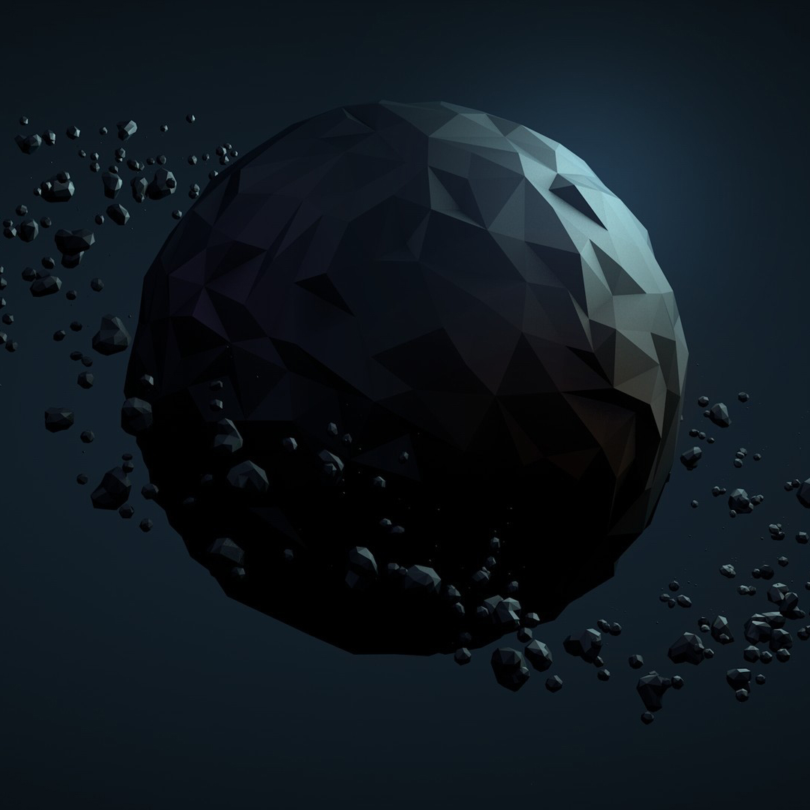

# 🔺 GeoMania

[](LICENSE) [](https://github.com/matzekFloyd/GeoMania/actions/workflows/ci.yml)

GeoMania is a small arcade game created during university and now prepared for a first public release.

You control a player in an 800x800 arena, shoot in four directions, and clear enemy waves across multiple levels.

## Features

- Retro-style Processing-based gameplay
- 3 enemy shape types (square, triangle, circle)
- Enemy splitting mechanic with increasing score
- Multiple levels with start and win screens
- Built-in score and timer display

## Tech Stack

- Java 8 (desktop)
- [Processing core](https://processing.org/) on the classpath via Maven Central (`org.processing:core:3.3.7`), resolved by Gradle (no manual `core.jar`)
- Gradle build (`build.gradle.kts`, `gradlew`) with Shadow fat JAR for releases
- Optional NetBeans metadata (`nbproject/`) for legacy IDE use
- Browser build: p5.js under `web/`

## Gameplay

- Move with arrow keys
- Shooting is tied to movement direction (holding an arrow key both moves and shoots)
- Clear all enemies to advance to the next level
- Defeating larger enemies splits them into smaller ones until they disappear

## Controls

- `Arrow keys`: move and shoot in pressed direction
- `P`: pause/unpause
- `S`: restart current level
- `R`: full game restart (back to start screen)
- `Space`: debug/cheat skip to next level

## Project Structure

- `src/main/java/geomania/`: desktop game (entry point `geomania.GeoMania`)
- `src/main/resources/data/geometry.jpg`: background image (bundled in the fat JAR)
- `web/`: browser implementation (p5.js)
- `nbproject/`: optional NetBeans metadata (sources point at `src/main/java`)

## Requirements (desktop)

1. **JDK 8 or newer** installed (Gradle uses a Java 8 toolchain for compilation). Gradle needs `java` on your `PATH` or **`JAVA_HOME`** pointing at a JDK install (not a bare JRE). If `.\gradlew.bat` prints `JAVA_HOME is not set`, install a JDK and open a **new** terminal.

   **Windows (winget):** `winget install -e --id EclipseAdoptium.Temurin.8.JDK`  
   Then open a **new** terminal and run `java -version`. If Gradle still cannot find Java, set `JAVA_HOME` to the JDK folder under `C:\Program Files\Eclipse Adoptium\` (the directory that contains `bin\java.exe`).

2. Nothing else: Processing is pulled from Maven Central on the first build.

## Desktop: build and run (Gradle)

From the repository root:

```powershell
# Windows — first run downloads Gradle (wrapper) if needed
.\gradlew.bat run
```

Run unit tests (JUnit 5):

```powershell
.\gradlew.bat test
```

Produce a single runnable fat JAR (Shadow), default version `1.1.0`:

```powershell
.\gradlew.bat shadowJar
java -jar build\libs\GeoMania-1.1.0-all.jar
```

Override the version string (for example to match a Git tag `v1.2.3`):

```powershell
.\gradlew.bat shadowJar -PgeoVersion=v1.2.3
java -jar build\libs\GeoMania-v1.2.3-all.jar
```

On Linux or macOS, use `./gradlew` instead of `.\gradlew.bat`.

## Run in NetBeans (optional)

Sources and resources follow the Gradle layout under `src/main/java` and `src/main/resources`. You still need `core.jar` on the classpath when opening as a plain Ant-based NetBeans project unless you use NetBeans’ Gradle integration and open this repo as a Gradle project.

## Browser Version (p5.js)

The repository now includes a browser-playable implementation in `web/`.

Run locally:

```powershell
cd web
npm install
npm run dev
```

Build static files:

```powershell
cd web
npm run build
```

The static output is written to `web/dist/` and can be hosted on any static host.

**Controls (browser):** Arrow keys or `W` `A` `S` `D` to move and shoot; on-screen D-pad on touch devices; `P` pause; `T` restart current level; `R` full restart to title; `Space` skip level.

When using a downloaded build bundle, do not open `index.html` directly via `file://` (browser module/CORS restrictions). Serve the extracted folder via HTTP instead, for example:

```bash
# from the extracted dist folder
python -m http.server 8080
# or
npx serve .
```

## Hosting on Netlify

GeoMania is configured for static deployment on Netlify via `netlify.toml`.

### One-time Netlify site setup

1. In Netlify, create a new site from your Git repository.
2. Use these build settings (already mirrored in `netlify.toml`):
   - Base directory: `web`
   - Build command: `npm ci && npm run build`
   - Publish directory: `dist`
3. Deploy the site.

### Ongoing deploy flow

- Push to your production branch (for example `main`) and Netlify will redeploy automatically.
- For a release tag, keep using the existing GitHub release process; Netlify deployment remains branch-driven.

### Hosted URL

- Production URL: `https://geo-mania.netlify.app/`

### Local preview of production build

```bash
cd web
npm run build
npx serve dist
```

## Releases / CI

GitHub Actions workflows:

- `ci.yml`: on pushes/PRs to `main` or `master` when `web/`, Java sources, or Gradle files change — **web** job (`npm ci` / `npm run build`, artifact `geomania-web-dist`), **desktop** job (`./gradlew build` on Ubuntu and Windows, fat JAR artifact from Windows), plus **dependency-submission** (Temurin 17) for Gradle dependency insights.
- `release.yml`: runs on `v*` tags, builds `web/dist`, builds `GeoMania-<tag>-all.jar`, and attaches both the web ZIP and the fat JAR to the GitHub Release.
- Web release bundle usage: extract the ZIP and serve it via HTTP (for example `python -m http.server 8080` or `npx serve .`) instead of opening `index.html` with `file://`.
- Desktop release: requires a **Java 8+** runtime on the player’s machine; run `java -jar GeoMania-v1.1.0-all.jar` (use the exact filename from the release).

Create a release build:

```bash
git tag v1.1.0
git push origin v1.1.0
```

## Screenshots



## Notes

- The desktop build loads `geometry.jpg` from the classpath (`data/geometry.jpg` inside the JAR). A plain `loadImage("geometry.jpg")` fallback remains for non-JAR runs if the resource is missing.
- Original source comments may contain a mix of English and German.

## Release Status

Releases ship the browser bundle (`web/`, built with `npm run build`) and the desktop fat JAR from Gradle (`shadowJar`), attached to GitHub Releases on version tags.

## Contributing

See [CONTRIBUTING.md](CONTRIBUTING.md).

## Security

See [SECURITY.md](SECURITY.md).

## License

This project is licensed under the MIT License. See `LICENSE` for details.
